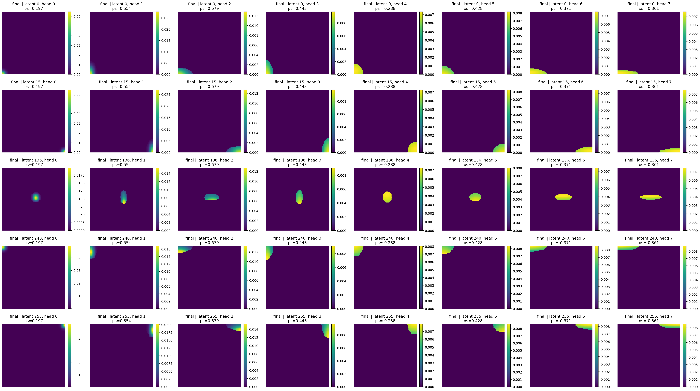
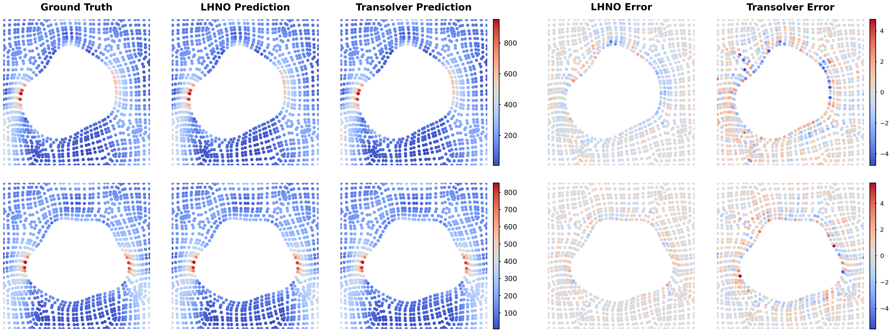
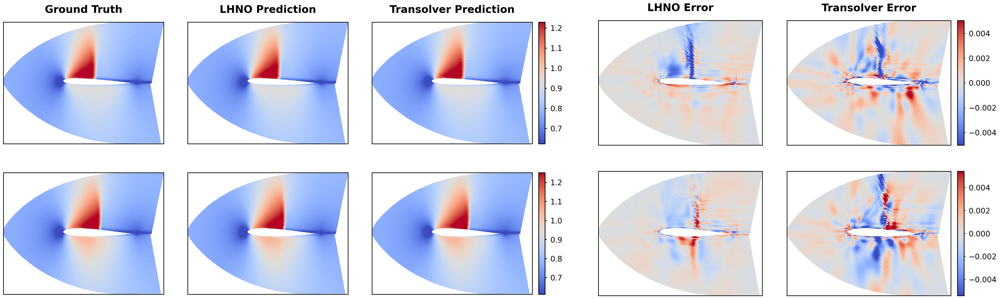
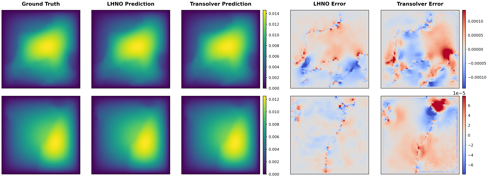
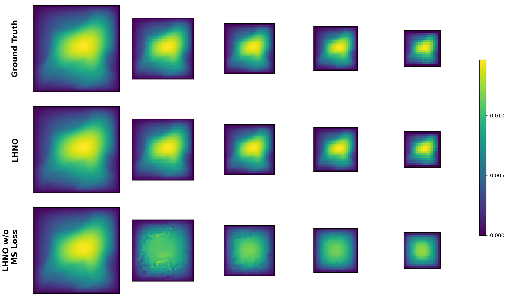
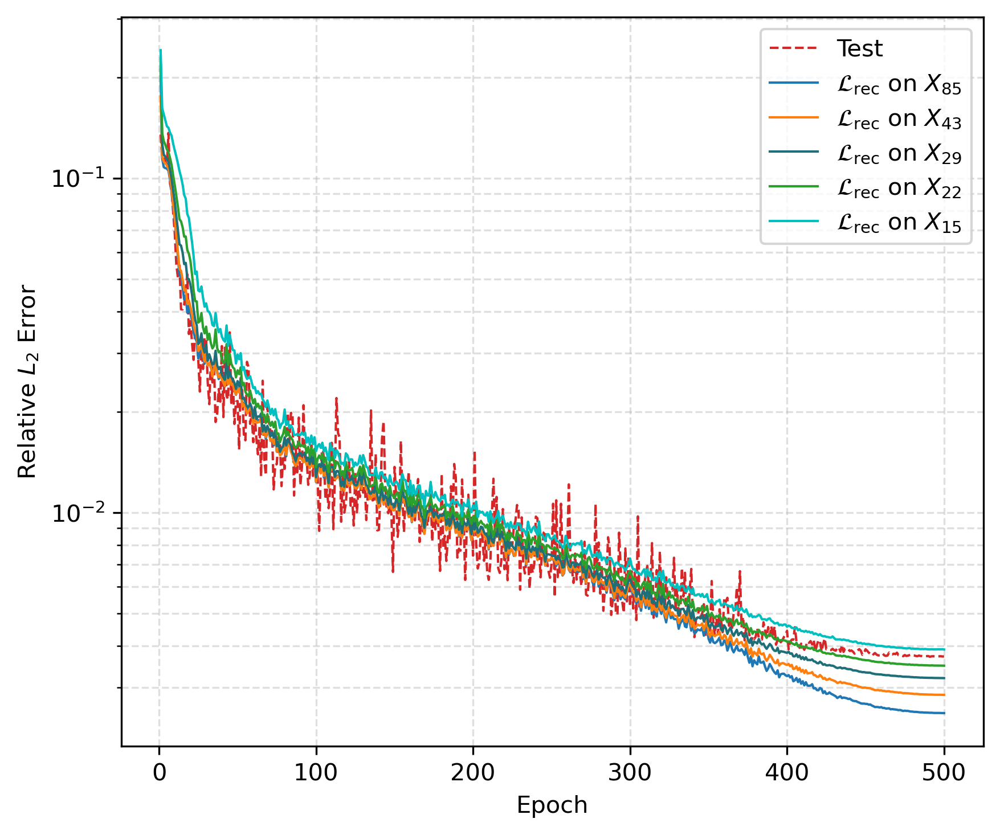
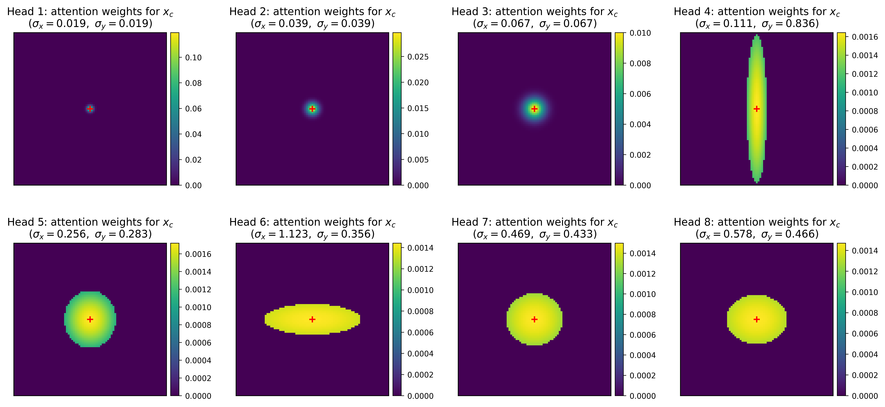

## Multi-scale Gaussian Neural Operator (MGNO)

---
<object data="files/framework5.pdf" type="application/pdf" width="100%" height="600px">
</object>
---

### 3.2 Gaussian Attention Mechanism
We first define Gaussian attention for transferring features between two latent levels through their associated meshes. 
Let $z^\ell \in \mathbb{R}^{N_\ell \times C}$ denote the latent feature at level $\ell$, defined on the source mesh

\begin{equation}
X^\ell=\{\bm{x}_i^\ell\}_{i=1}^{N_\ell}\subset\Omega,
\qquad 
\bm{x}_i^\ell=(x_{i,1}^\ell,\ldots,x_{i,d}^\ell)\in\mathbb{R}^d.
\end{equation}
The target mesh associated with level $\ell+1$ is denoted by

\begin{equation}
X^{\ell+1}=\{\bm{x}_m^{\ell+1}\}_{m=1}^{N_{\ell+1}}\subset\Omega,
\qquad 
\bm{x}_m^{\ell+1}=(x_{m,1}^{\ell+1},\ldots,x_{m,d}^{\ell+1})\in\mathbb{R}^d.
\end{equation}
Here, $N_\ell$ and $N_{\ell+1}$ are the numbers of mesh points on the source and target meshes, respectively.
---
#### 3.2.1 Gaussian Attention
Gaussian attention transfers features from $X^\ell$ to $X^{\ell+1}$ using position-dependent weights. 

Let
$\bm{\sigma}=(\sigma_1,\ldots,\sigma_d)\in\mathbb{R}_+^d$ be positive
Gaussian scale parameters. The Gaussian kernel between a target
point $\bm{x}_m^{\ell+1}$ and a source point $\bm{x}_i^\ell$ is defined as

\begin{equation}
	g_{\bm{\sigma}}(\bm{x}_m^{\ell+1},\bm{x}_i^\ell)
	=
	\exp\left(
	-\sum_{j=1}^{d}
	\left(
	\frac{x_{m,j}^{\ell+1}-x_{i,j}^{\ell}}{\sigma_j}
	\right)^2
	\right).
\end{equation}

---
The attention weight from $\bm{x}_i^\ell$ to $\bm{x}_m^{\ell+1}$ is obtained
by normalizing over all source points:

\begin{equation}
	a_{mi}
	=
	\frac{
		g_{\bm{\sigma}}(\bm{x}_m^{\ell+1},\bm{x}_i^\ell)
	}{
		\sum_{r=1}^{N_\ell}
		g_{\bm{\sigma}}(\bm{x}_m^{\ell+1},\bm{x}_r^\ell)
	}.
\end{equation}

The transferred feature at the $m$-th target point is then given by

\begin{equation}
	\label{eq_gauatt}
	z_m^{\ell+1}
	=
	\operatorname{GauAtt}(z^\ell,X^\ell,X^{\ell+1})_m
	=
	\sum_{i=1}^{N_\ell}
	a_{mi}\, z_i^\ell W_v ,
\end{equation}
where $W_v\in\mathbb{R}^{C\times C}$ is a learnable value projection matrix.

---
Although Gaussian attention is implemented on finite meshes, its row-wise
normalized kernel form gives it a continuous operator interpretation.

---

---

---
#### 3.2.3 Basic Gaussian Attention Blocks
In the previous subsection, we introduced Gaussian attention to transfer features across different meshes. 
Based on this mechanism, we construct two types of Gaussian attention blocks, namely the **cross Gaussian attention block** and the **Gaussian attention block**, which serve as the fundamental building blocks of the proposed method.
---

<object data="files/framework4.pdf" type="application/pdf" width="100%" height="600px">
</object>

---
**Cross Gaussian Attention Block**

When $N \neq M$, Gaussian attention  can be viewed as a form of cross attention, which maps features between two meshes with different numbers of points.
For example, it can downsample the feature $z^{\ell}$ from $X^{\ell}$ to $X^{\ell+1}$ to obtain $z^{\ell+1}$ when $M < N$. 

Moreover, to enhance the expressive power of the model, we combine Gaussian attention with a multilayer perceptron (MLP) to form a cross Gaussian attention block, defined as follows

\begin{equation}
	\begin{aligned}
		\hat{z}^{\ell+1} &= \text{GauAtten}(z^{\ell}, X^{\ell}, X^{\ell+1}) ,\\
		z^{\ell + 1} &= \text{MLP}(\hat{z}^{\ell+1}).
	\end{aligned}
\end{equation}	

---
**Gaussian Attention Block**
In the processor, features are updated on the same mesh $X^{\ell}$. 
Therefore, we follow the standard Transformer block design and introduce residual connections.
The Gaussian attention block is defined as follows

\begin{equation}
	\begin{aligned}
		\hat{z}^{\ell+1} &= \text{GauAtten}(z^{\ell}, X^{\ell}, X^{\ell}) + z^{\ell}  \\
		z^{\ell + 1} &= \text{MLP}(\hat{z}^{\ell+1}) + \hat{z}^{\ell+1}.
	\end{aligned}
\end{equation}	

---
## 5 Experiments
### 5.1 Experimental Setup
Table: Summary of PDE benchmarks and mesh hierarchies used by MGNO.  

| Data Structure | Benchmark | Dim | Level | Mesh hierarchy |
|---|---|---:|---:|---|
| Point Cloud | Elasticity | 2D | 3 | 972 → 512 → 256 |
| Structured Mesh | Airfoil | 2D |  | 11,271 |
| Structured Mesh | Pipe | 2D |  | 16,641 |
| Regular Grid | Darcy | 2D | 5 | 85² → 43² → 29² → 22² → 15² |
| Regular Grid | Boltzmann | 3D+Time | 3 | 24³ → 12³ → 6³ |

---
### 5.2 Results on PDE Benchmarks
#### 5.2.1 Elasticity
The elasticity benchmark evaluates operator learning on point-cloud data.
The task is to predict the internal stress of an elastic material from its discretized geometry.

---

---
#### 5.2.3 Airfoil
The Airfoil benchmark evaluates operator learning on structured meshes with complex geometries. 
---

---
#### 5.2.2 Darcy
This benchmark models the flow of fluid through a porous medium. 
The model takes the diffusion coefficient $a$ as input and predicts the solution $u$. 

---

---
#### 5.3.3 Mutli-scale Predictions

---
### 5.3 Model Analysis
#### 5.3.1 Analysis of Latent Hierarchy

Table: Ablation study on latent hierarchy schedules on Darcy.  Here, X_s denotes a uniform s × s mesh.  All latent meshes are directly subsampled from the finest 85 × 85 input mesh without introducing off-grid interpolation points. s = (85 -1) / r_s +1

| Levels | Mesh hierarchy | Params | Time/epoch | Test L2 |
|:---|---|:---|:---|:---|
| 2 | 85² → 15² | 121K | 3.03 | 0.00555 |
| 3 | 85² → 29² → 15² | 179K | 4.42 | 0.00414 |
| 3 | 85² → 43² → 15² | 179K | 8.42 | 0.00396 |
| 4 | 85² → 43² → 22² → 13² | 237K | 8.78 | 0.00392 |
| 4 | 85² → 43² → 22² → 15² | 237K | 8.84 | 0.00390 |
| 4 | 85² → 43² → 29² → 15² | 237K | 9.14 | <u>0.00377</u> |
| 5 | 85² → 43² → 29² → 22² → 15² | 295K | 9.52 | **0.00371** |

---

| Levels | Mesh hierarchy | Test L2 |
|:---|---|:---|
| 4 | $X_{85}\to X_{43}\to X_{22}\to X_{13}$ | 0.00392 |
| 4 | $X_{85}\to X_{43}'\to X_{22}'\to X_{12}'$ | 0.00399 |
| 5 | $X_{85}\to X_{43}\to X_{29}\to X_{22}\to X_{15}$ | 0.003717 |
| 5 | $X_{85}\to X_{43}'\to X_{29}'\to X_{22}'\to X_{15}'$ | 0.003718 |

---

#### 5.3.2 Analysis of Multi-scale Supervision

---
#### 5.3.2 Analysis of Gaussian Attention

