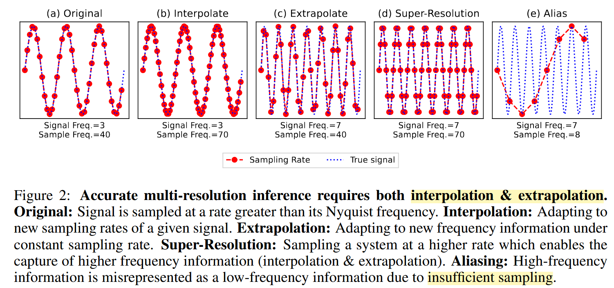

# 多分辨率训练与频率视角

### 从 Nyquist 限制到神经算子加速训练

**目标：**

> 使用低成本的低分辨率数据加速训练，
> 同时维持与 full-resolution training 可竞争的最终精度。

参考：

- *The False Promise of Zero-Shot Super-Resolution in Machine-Learned Operators*, ICLR 2026
- *Breaking Scale Anchoring: Frequency Representation Learning for Accurate High-Resolution Inference from Low-Resolution Training*, ICLR 2026

---

## 1. 当前观察：粗网格有效，但信息量低

已有实验给出了两个结果。

**Multi-stage Training**

$$
\text{coarse}
\rightarrow
\text{mid}
\rightarrow
\text{fine}
$$

最终精度可以达到甚至优于 full-resolution training。 coarse stage 很快收敛，通常只需要少量 epochs。因此继续在粗网格上训练的收益迅速下降。

**MLMC-style Training**

每个 epoch 使用：

$$
\text{大量 coarse}
+
\text{少量 fine}
$$

训练花费明显下降。但最终 fine-resolution accuracy 下降。

---

### 核心问题

> **低分辨率数据应该在什么时候使用、使用多少？**

---

## 2. Nyquist 定理：粗网格存在信息上限

对采样率 $r$：

$$
f_{\mathrm{Nyq}}=\frac{r}{2}.
$$

固定物理区域上，若使用 $N$ 个均匀采样点，可以近似理解为：

$$
f_{\max}\sim\frac{N}{2}.
$$

因此：

$$
N_{\mathrm{coarse}}<N_{\mathrm{fine}}
\quad\Rightarrow\quad
f_{\mathrm{Nyq}}^{\mathrm{coarse}}
<
f_{\mathrm{Nyq}}^{\mathrm{fine}}.
$$

---

**直观理解：**
粗网格无法正确表示超出 Nyquist limit 的频率。
换句话说，粗网格仅需少量迭代，是因为它实际上对应了一个信息更少、频率范围更窄的学习任务。

---

## 3. 多分辨率训练：少量 fine 数据仍然很重要

*The False Promise of Zero-Shot Super-Resolution...*

论文得到如下结论：

> 模型通常在训练时真正见过的分辨率上表现最好。

因此，仅使用 coarse data 并不能可靠替代 fine data。但另一方面，训练集也不需要全部由昂贵的 fine samples 构成。

可以使用：

$$
\boxed{
\text{Mostly Low Resolution}
+
\text{A Small Amount of High Resolution}
}
$$

尽管，我们认为，效率的提升以最细网格上的精度为代价是不可取的。

---

## 4. 多分辨率训练：学习不同 Nyquist bands

*Breaking Scale Anchoring...*

这篇工作进一步从频率角度解释早先的多分辨率训练，并提出了一个新的损失函数，使用少量的细网格数据也能提供足够信息。

构造：

$$
\rho_0,\quad
\rho_0/2,\quad
\rho_0/4,\ldots
$$

每个 resolution 对应不同的 Nyquist cutoff：

$$
f_{\mathrm{Nyq}}(\rho_0) > f_{\mathrm{Nyq}}(\rho_0/2) > f_{\mathrm{Nyq}}(\rho_0/4).
$$

因此，多分辨率训练实际上让模型看到：

$$
\text{不同宽度的 frequency bands}.
$$

---

FRL 在此基础上进一步加入：
**Nyquist-normalized representation**。

$$
\xi=\frac{|k|}{k_{\mathrm{Nyq}}(\rho)}
$$

以及 frequency-domain consistency loss：

$$
\mathcal L = \mathcal L_{\mathrm{space}} + \lambda\mathcal  L_{\mathrm{freq}}.
$$

通过这个损失，模型就具有一定的能力泛化到更高的频率，并且仅仅依赖少量细网格数据，这就有助于提升训练效率。

---

## 5. 重新理解已有实验

### 为什么 Multi-stage Training 有效？

$$
\text{coarse}
\rightarrow
\text{mid}
\rightarrow
\text{fine}
$$

可以重新解释为：

$$
\text{low frequency}
\rightarrow
\text{wider frequency band}
\rightarrow
\text{full frequency band}.
$$

粗网格阶段：
任务简单。快速学习主要结构与低频模式。很少 epochs 后，低频部分已经基本收敛。
随后提升分辨率：
扩展 Nyquist band。引入此前不存在的中高频监督。在已有低频表示基础上继续优化。

因此：

**coarse training 更适合提供好的初始化，而不是承担整个训练过程。**

这与我们观察到“粗网格只需要几个 epochs”是一致的。

---

## 6. 为什么固定比例 MLMC 会损失精度？

MLMC-style training 每个 epoch 都保持类似：

$$
N_{\mathrm{coarse}}\gg N_{\mathrm{fine}}.
$$

从计算成本看，这是高效的。

但从频率覆盖看：
**训练后期仍然大量重复 coarse samples**。

这些样本主要提供：

$$
f<f_{\mathrm{Nyq}}^{\mathrm{coarse}}
$$

范围内的监督。

---

而真正决定最终 fine-grid accuracy 的：

$$
f_{\mathrm{Nyq}}^{\mathrm{coarse}}
<
f
<
f_{\mathrm{Nyq}}^{\mathrm{fine}}
$$

只能由 fine data 提供。

因此后期可能出现：

> **低频监督已经冗余，但训练预算仍大量消耗在 coarse grid；高频监督反而不足。**

这可以解释：

$$
\text{MLMC}
\Rightarrow
\text{faster training}
\quad\text{but}\quad
\text{lower final accuracy}.
$$

---

## 7. 对现有多分辨率训练的借鉴与不足

两篇工作的共同启发是：

$$
\boxed{
\text{大量 coarse}
+
\text{必要的 fine supervision}
}
$$

可以改善训练成本与精度之间的 trade-off。

但是，现有方法通常使用固定的数据比例。

例如整个训练过程中始终保持：

$$
p_{\mathrm{coarse}},
\quad
p_{\mathrm{mid}},
\quad
p_{\mathrm{fine}}
$$

基本不变。

但我们的实验说明：

> **不同 resolution 的价值会随着训练进程发生变化。**

---

早期：

- coarse data 非常有价值
- 可以快速学习低频结构

后期：

- coarse data 边际收益迅速下降
- fine data 才决定最终精度

因此固定比例可能不是最优的计算资源分配方式。

---

## 8. 下一步：Dynamic Resolution Curriculum

### Early Stage

$$
p_{\mathrm{coarse}}\gg p_{\mathrm{fine}}
$$

大量 coarse data：

快速学习低频。获得好的初始化。大幅降低前期计算成本。

### Middle Stage

逐步扩大 resolution：

$$
\text{coarse}
\rightarrow
\text{mid}
\rightarrow
\text{fine}
$$

不断扩展模型看到的 frequency band。

### Late Stage

$$
p_{\mathrm{fine}}\rightarrow 1
$$

或者至少保证：
**所有 high-resolution samples 在训练后期得到充分覆盖。**
最终阶段主要负责恢复 full-resolution accuracy。

